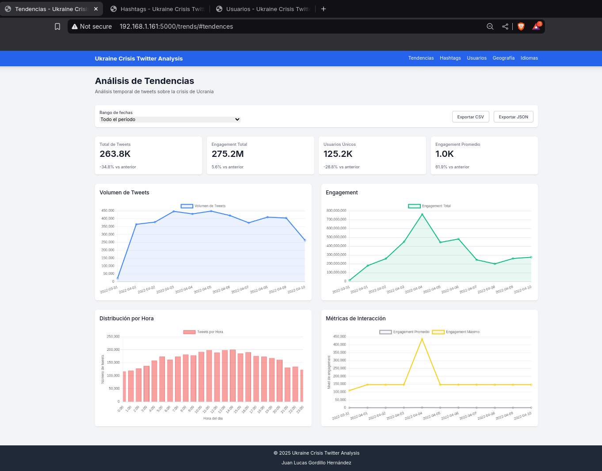
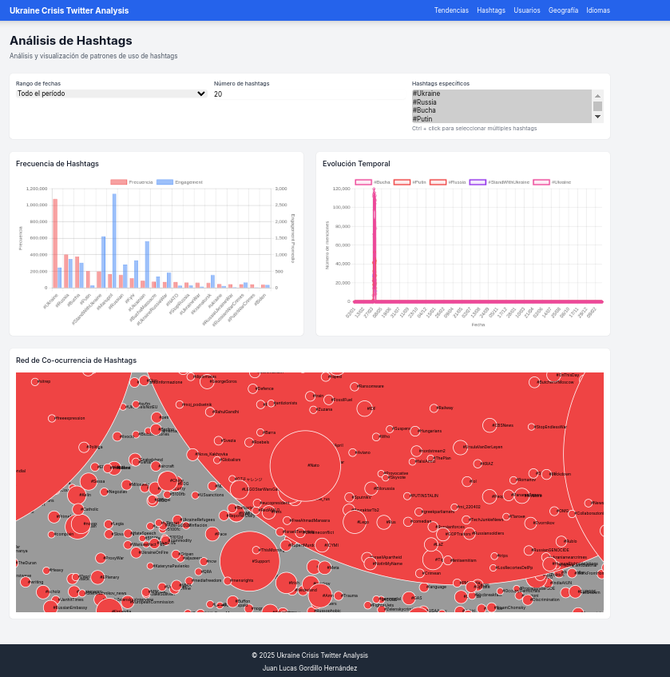
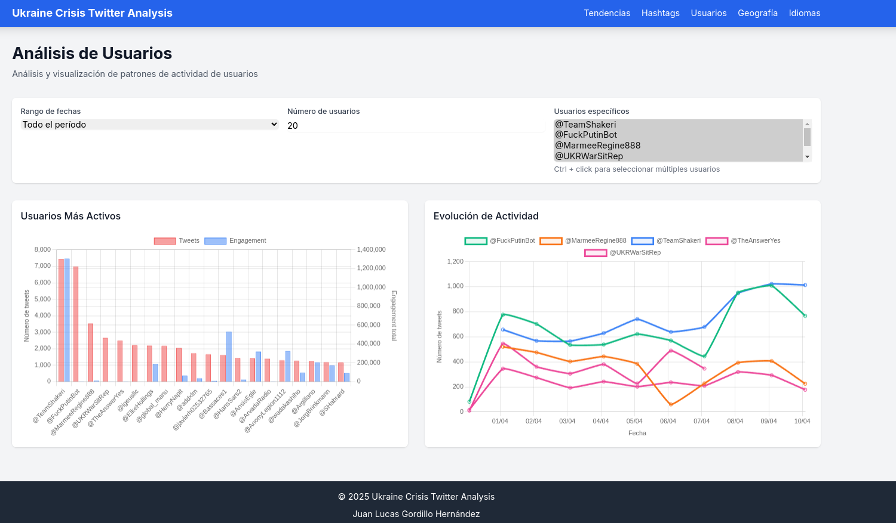

# Ukraine Crisis Twitter Analysis

Aplicación web Flask para el análisis de tweets relacionados con la crisis de Ucrania. El dataset usado se ha extraído de Kaggle: [Click aquí](https://www.kaggle.com/datasets/bwandowando/ukraine-russian-crisis-twitter-dataset-1-2-m-rows) 

## Requisitos previos

- Python 3.8 o superior
- MongoDB 4.4 o superior
- pip (gestor de paquetes de Python)
- virtualenv (opcional, pero recomendado)

## Instalación

1. Clona el repositorio:
```bash
git clone <https://github.com/gooorher/Ukraine-Crisis-Tweets-Analysis/>
cd flask_app
```

2. Da permisos de ejecución al script de configuración:
```bash
chmod +x setup.sh
```

3. Ejecuta el script de configuración:
```bash
./setup.sh
```

4. Activa el entorno virtual:
```bash
source venv/bin/activate
```

## Configuración

El script `setup.sh` creará un archivo `.env` con la configuración básica. Puedes modificar este archivo según tus necesidades:

```env
FLASK_APP=app.py
FLASK_ENV=development
FLASK_DEBUG=1
MONGO_URI=mongodb://localhost:27017/ukraine_crisis
SECRET_KEY=your-secret-key-here
```

## Uso

1. Asegúrate de que MongoDB esté en ejecución:
```bash
sudo systemctl start mongod  # Para sistemas basados en systemd
# o
mongod  # Para iniciar manualmente
```

2. Activa el entorno virtual si no está activado:
```bash
source venv/bin/activate
```

3. Ejecuta la aplicación:
```bash
python app.py
```

4. Abre un navegador y visita:
```
http://localhost:5000
```

## Estructura del proyecto

```
flask_app/
├── app.py                  # Aplicación principal Flask
├── requirements.txt        # Dependencias del proyecto
├── setup.sh               # Script de configuración
├── services/              # Lógica de negocio
│   ├── __init__.py
│   ├── trends_service.py
│   ├── hashtags_service.py
│   └── users_service.py
├── routes/                # Rutas de la aplicación
│   ├── __init__.py
│   ├── trends_routes.py
│   ├── hashtags_routes.py
│   └── users_routes.py
├── templates/             # Plantillas HTML
│   ├── base.html
│   ├── trends.html
│   ├── hashtags.html
│   └── users.html
├── static/               # Archivos estáticos
│   ├── css/
│   └── js/
└── utils/               # Utilidades
    ├── __init__.py
    ├── date_utils.py
    └── log_analyzer.py
```

## Características

- Análisis de tendencias temporales
- Visualización de hashtags populares
- Análisis de usuarios activos
- Gráficos interactivos
- Exportación de datos
- Sistema de logging avanzado

## Capturas de pantalla de la aplicación

A continuación, se muestran capturas de pantalla de las tres secciones principales de la aplicación: Tendencias, Hashtags y Usuarios.

### Sección de Tendencias

En esta sección se visualizan las tendencias diarias y semanales de los tweets relacionados con la crisis de Ucrania.



### Sección de Hashtags

En esta sección se analizan los hashtags más populares y su evolución temporal.



### Sección de Usuarios

En esta sección se muestra la actividad y el engagement de los usuarios más relevantes.



## Endpoints API


### Tendencias
- GET `/trends/` - Página principal de tendencias
- GET `/trends/api/daily` - Datos de tendencias diarias
- GET `/trends/api/weekly` - Datos de tendencias semanales

### Hashtags
- GET `/hashtags/` - Página de análisis de hashtags
- GET `/hashtags/api/frequency` - Frecuencia de hashtags
- GET `/hashtags/api/evolution` - Evolución temporal de hashtags
- GET `/hashtags/api/cooccurrence` - Red de co-ocurrencia

### Usuarios
- GET `/users/` - Página de análisis de usuarios
- GET `/users/api/activity` - Actividad de usuarios
- GET `/users/api/engagement` - Métricas de engagement
- GET `/users/api/evolution` - Evolución temporal de usuarios

## Testing

Para ejecutar las pruebas:

```bash
python -m pytest
```

## Logging

Los logs se almacenan en el directorio `logs/`:
- `flask_app.log` - Log principal de la aplicación
- `errors.log` - Log específico de errores
- `access.log` - Log de accesos HTTP

## Monitoreo

Endpoint de health check:
```
GET /health
```

## Mantenimiento

1. Actualizar dependencias:
```bash
pip install --upgrade -r requirements.txt
```

2. Limpiar logs:
```bash
> logs/flask_app.log
> logs/errors.log
> logs/access.log
```

3. Verificar MongoDB:
```bash
mongosh
use ukraine_crisis
db.tweets.stats()
```

## Solución de problemas

### Error de conexión a MongoDB
1. Verifica que MongoDB esté en ejecución
2. Comprueba la URI de conexión en `.env`
3. Verifica los permisos de la base de datos

### Error de CORS
1. Verifica que flask-cors esté instalado
2. Comprueba la configuración de CORS en `app.py`

### Errores de importación
1. Asegúrate de que el entorno virtual esté activado
2. Verifica que todas las dependencias estén instaladas
3. Comprueba la variable de entorno PYTHONPATH

## Contribuir

1. Fork el repositorio
2. Crea una rama para tu feature
3. Realiza tus cambios
4. Envía un pull request

## Licencia

Este proyecto está bajo la licencia MIT.